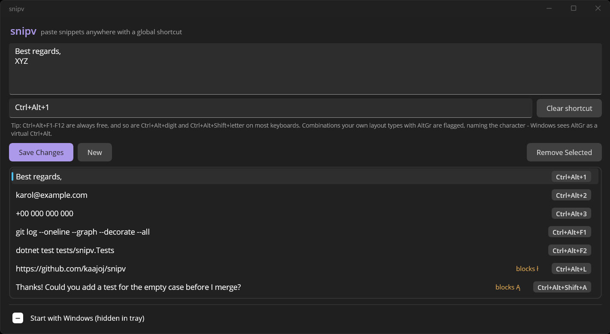
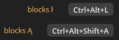

# snipv

A tiny Windows tray app for pasting text snippets anywhere with global hotkeys.



Define a snippet, record a shortcut for it, and from then on pressing that
shortcut in **any** application pastes the snippet at the cursor (clipboard +
synthesized Ctrl+V). Built with .NET MAUI (WinUI 3).

Taking a global hotkey is not free: on some keyboard layouts the combination you
pick is one the layout itself uses to type a character. snipv asks Windows what
every installed layout types with AltGr, and warns you before a shortcut costs
you a key.

The name is `snip` + **V**, as in Ctrl+**V** - the shortcut it presses for you.

## Features

- **Global hotkeys** - work regardless of which application has focus
  (`RegisterHotKey` + `WM_HOTKEY` via window subclassing).
- **Shortcut recorder** - click the shortcut field and press the combination;
  no typing needed.
- **Shortcut safety policy** - refuses combinations that are not yours to take:
  the everyday Ctrl+letter shortcuts (copy, paste, save, find, undo and the
  rest), the near-universal Ctrl+Shift ones (Esc, T, N, P, V, C, F), Alt+F4, and
  anything whose only modifier is Shift or Win. A combination with a single
  modifier that survives the list is still only accepted with a warning, since
  those collide with in-app shortcuts everywhere. Before saving, snipv also
  probes whether another application already holds the combination globally, by
  registering it for real and releasing it again.
- **Keyboard layout aware** - AltGr is not a modifier of its own: the layout
  driver holds a virtual Ctrl alongside it, so Windows sees AltGr as Ctrl+Alt
  and AltGr+Shift as Ctrl+Alt+Shift. The probe asks each installed layout what
  it types that way (`GetKeyboardLayoutList` for the layouts, `ToUnicodeEx` with
  Ctrl+Alt held for the characters), and the policy warns off exactly those
  combinations. Nothing about it is language-specific: a Polish layout reports
  characters such as ł ó ż, a German one @ € µ, a US one nothing at all. The
  warning names the character at stake and can be overruled, since you are the
  one who can tell when the probe got it wrong. A dead key counts as taken as
  well: it composes an accent with the next keystroke rather than typing a
  character itself, so the warning can only say that a character is at stake.
- **A shortcut that costs you a key says so** - the check runs when a shortcut
  is saved, so a snippet can predate it or be overtaken by a keyboard layout
  installed later. Those rows carry the character they swallow, next to the
  shortcut. Shift is part of the answer, because the layout types the capital
  with AltGr+Shift:

  
- **Multi-line snippets** - signatures, code fragments, canned replies.
- **Editing** - select a snippet on the list to edit its text or shortcut, or
  clear the shortcut to keep the text without a hotkey.
- **No snippet is deleted behind your back** - before a shortcut changes hands
  the dialog shows what that shortcut currently pastes, and the snippet losing
  it stays on the list marked "no shortcut" instead of disappearing. Removing a
  snippet is the only thing that deletes text, and it asks first.
- **Tray app** - closing the window hides it to the notification area; the
  icon's left click restores it, right click offers Show/Exit.
- **Single instance** - launching a second copy just brings the running one
  back to front.
- **Autostart** - optional "Start with Windows (hidden in tray)" checkbox;
  managed via an `HKCU\Software\Microsoft\Windows\CurrentVersion\Run` entry
  that launches `snipv.exe --tray`.
- **Window geometry** - position and size come back with the app. A rectangle
  that no longer lands on a connected monitor is ignored rather than restored,
  and restoring from the tray pulls a window back onto the screen if the
  monitor it lived on has been unplugged meanwhile.
- **Persistence** - snippets live in `%LOCALAPPDATA%\snipv\snippets.json`
  (a fixed path, independent of the app identity) as a list of
  `{ "Shortcut": ..., "Content": ... }` entries. Writes go through a temporary
  file and an atomic move, a file that cannot be parsed is renamed to
  `snippets.json.corrupt` rather than overwritten, and a change that cannot be
  written at all is reported instead of looking saved until the next start.

## Known limitations

- **Elevated (admin) windows**: Windows blocks synthesized input from a normal
  process into an elevated one (UIPI), so the automatic Ctrl+V never reaches
  e.g. an admin terminal. The snippet is still placed on the clipboard, so a
  manual Ctrl+V works.
- Pasting goes through the clipboard and the snippet intentionally stays there
  afterwards (no clipboard restore).

## Recommended shortcut pools

| Pool | Notes |
| --- | --- |
| `Ctrl+Alt+F1-F12` | Always free; function keys never type a character |
| `Ctrl+Alt+0-9` | Free unless your layout puts a character on AltGr+digit |
| `Ctrl+Alt+Shift+letter` | Free unless your layout types that letter with AltGr+Shift |

snipv warns about the exceptions and names the character at stake, so you can
also just record a combination and see what it says.

While snipv runs, its hotkeys win over in-app shortcuts of other programs -
that is what the safety policy protects against.

## Tests

**Unit** (shortcut policy, keyboard layout probe, snippet storage):

```
dotnet test tests/snipv.Tests
```

**End-to-end** - drives the real app through UI Automation, the real keyboard
and the clipboard, in eight steps: adds a snippet (recording `Ctrl+Alt+F9`),
fires the global hotkey, checks the reserved-shortcut block, hands the shortcut
to a second snippet and checks that the first one is kept without one, edits the
snippet and fires the hotkey again, removes it, and verifies close-to-tray plus
the single-instance behavior.

1. Build the version under test first:

   ```
   dotnet build -c Release
   ```

2. Run the script:

   ```
   powershell -ExecutionPolicy Bypass -File tests\e2e\run-e2e.ps1
   ```

Notes:

- Don't touch the mouse or keyboard while it runs (~1 minute) - it sends real
  key chords and moves window focus.
- It stops any running snipv first, clears out anything an earlier failed run
  left behind, and cleans up its test snippet and your clipboard afterwards.
- Exit code 0 means every assertion passed; failures are listed at the end.
- To test a different build, pass `-ExePath <path\to\snipv.exe>`.

## Building

Requires the .NET 10 SDK with the MAUI workload on Windows:

```
dotnet build snipv.csproj
```

The exe lands in `bin\Debug\net10.0-windows10.0.19041.0\win-x64\snipv.exe`
(unpackaged, `WindowsPackageType=None`).

Note: if you move the exe (e.g. publish a Release build), re-tick the
autostart checkbox so the registry entry points at the new path.

## License

[MIT](LICENSE)

### Third-party notices

- **Open Sans** (`Resources/Fonts/*.ttf`) - copyright Google, licensed under the
  Apache License 2.0; see
  [LICENSE-OpenSans.txt](Resources/Fonts/LICENSE-OpenSans.txt).
